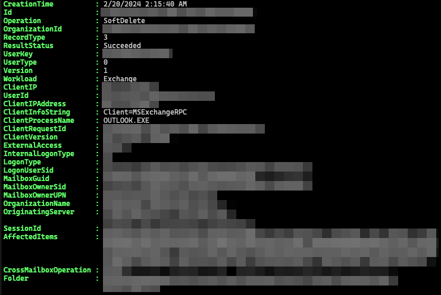

# Extract AuditData From Unified Audit Log Search

## Problem

You want to extract the SoftDelete and HardDelete audit data returned after running `Search-UnifiedAuditLog`.

## Solution

First, save the results to a variable:

```powershell
[array]$results = Search-UnifiedAuditLog -RecordType ExchangeItemGroup -StartDate (Get-Date).AddDays(-1) -EndDate (Get-Date).AddDays(0.5) -ResultSize 400
```

This creates an array of unified audit log records but the data for the events is located in the `AuditData` property.
The value of `AuditData` is a JSON formatted string.


Create a new array with just the audit data.

```powershell
[array]$audit += $results | Foreach-Object{ConvertFrom-Json $_.AuditData}
```
Now the data is what would be returned from the `Search-MailboxAuditLog` cmdlet.



## Discussion

The `Search-MailboxAuditLog` cmdlet is being deprecated on April 30, 2024.
Microsoft is streamlining audit logs searches into the `Search-UnifiedAuditLog` cmdlet.[^1]

Exchange Record Types [^2]:

+ ExchangeAdmin
+ ExchangeItem
+ ExchangeItemGroup

## References

[^1]: Microsoft blog [article](https://techcommunity.microsoft.com/t5/security-compliance-and-identity/important-announcement-deprecation-of-adminauditlog-and/ba-p/4036537) detailing the deprecation of `Search-MailboxAuditLog cmdlet.

[^2]: All audit log [record types](https://learn.microsoft.com/en-us/office/office-365-management-api/office-365-management-activity-api-schema#enum-auditlogrecordtype---type-edmint32)
